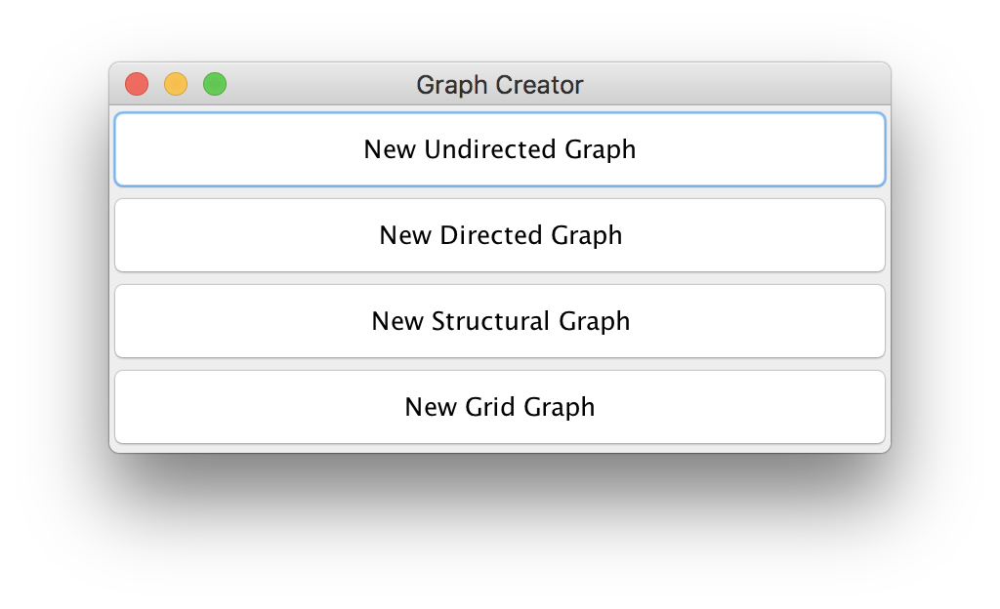
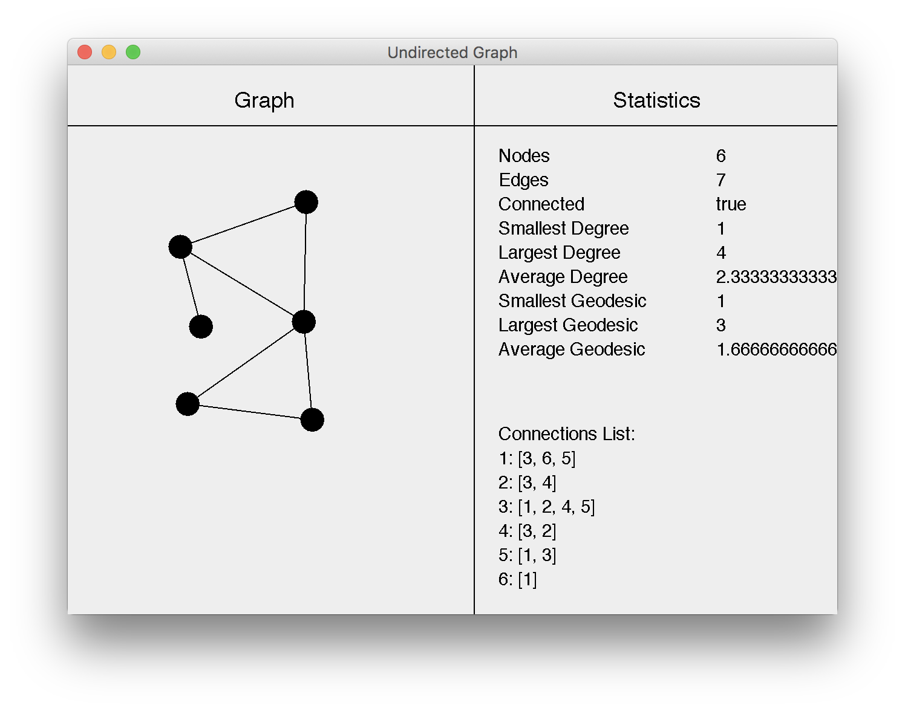
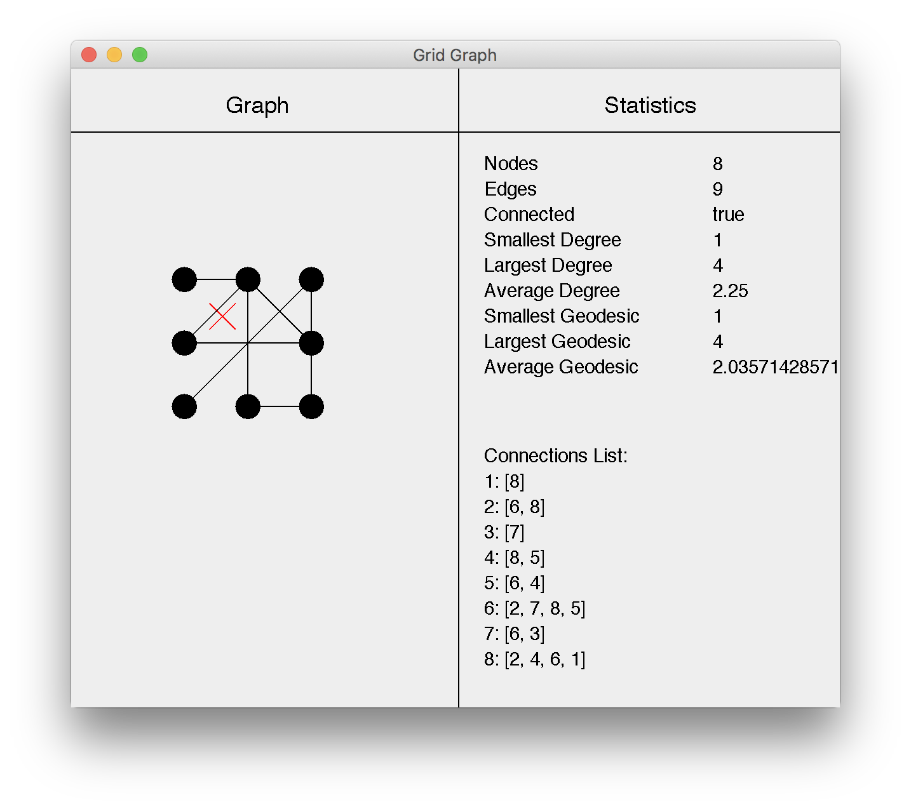
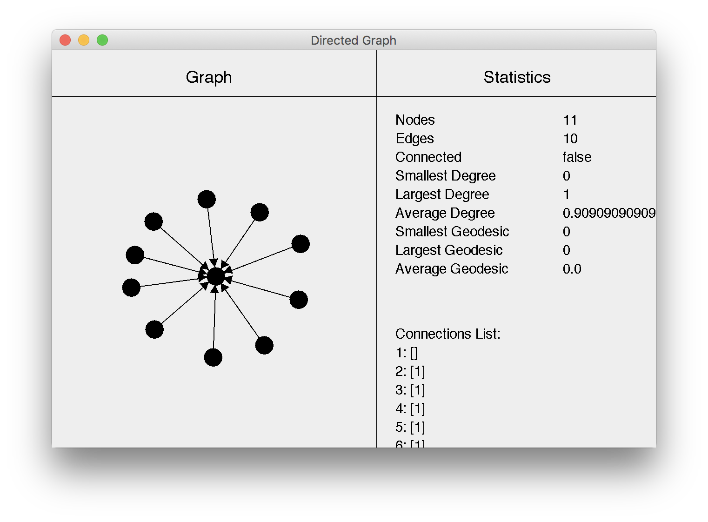
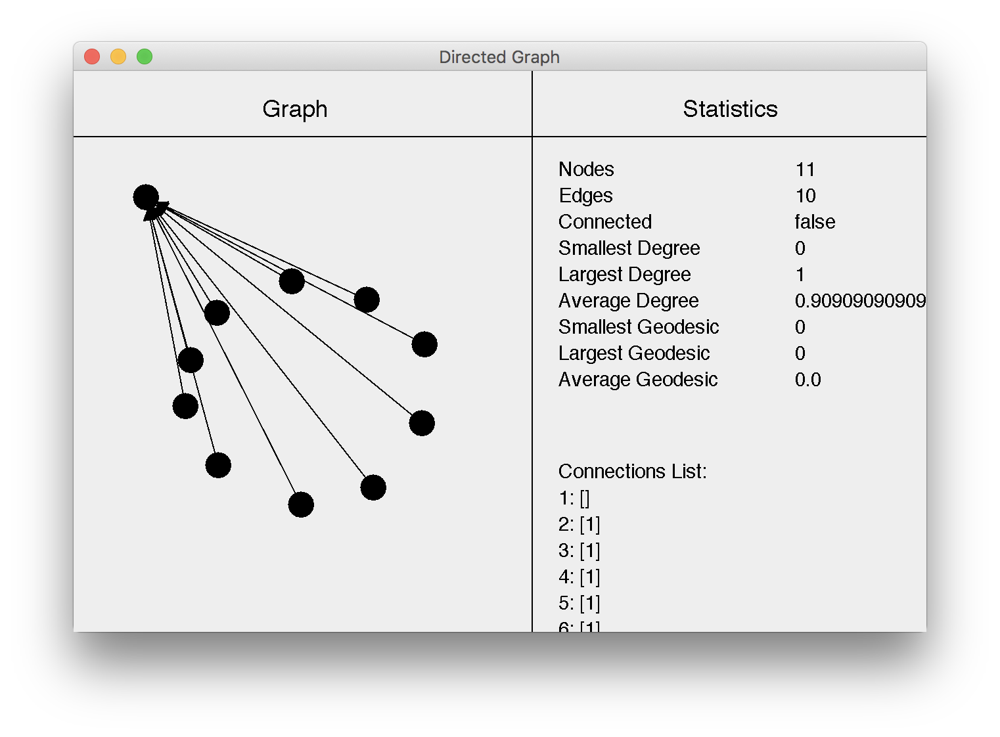

# Graph Builder

To build and run the application, run the two commands below:

```
./gradlew build
java -jar build/libs/graph-builder-1.0.0.jar
```

Upon opening the program, you will see the following
start screen.



This screen allows for you to select the type of graph you want to create. When you select
a graph type, a new window will open. The graph drawing window consists of two sections:
the graph section for drawing the graph and the statisitcs section which maintains live 
statistics as you create the graph.



To create a node, hold down the n key. An outline of a node will appear under the cursor.
Click the mouse while holding n to place a node. To create an edge, move the cursor near
the node you wish to create an edge from, press e and an edge will appear from the 
nearest node the the cursor. Click on another node to create an edge between the two nodes.
(Note: for a structural graph, holding e creates a positive (+) edge and holding r creates
a negative (-) edge.)


To delete an edge or node, hold down the d key. A red x will
appear under the cursor. Hover over the node or edge to delete and click the mouse while
holding d. If you delete a node, all edges adjacent to it will also be deleted.



Lastly, you can hold down on a node and move the cursor to move the node on the screen.




